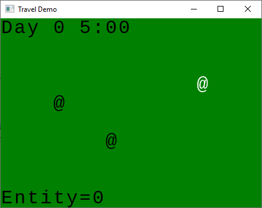
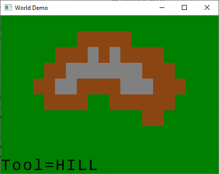

= Release Notes

[%header,cols="^.<,4a"]
|===
| Release
| Notes

| 0.2.0
|

.A simple travel demo with ECS & Redux

*New:*

* A entity component system implementation for java.
* A system to manage time.
* Entities can travel the map.

*CI:*

* Started using https://travis-ci.com/Orchaldir/FantasyWilderness[Travis CI]
* Started using https://sonarcloud.io/dashboard?id=groupId%3AFantasyWilderness[SonarCloud]

| 0.1.0
|

.A simple world editor with Redux

*New:*

* A Redux implementation for java.
* Tile maps to render the game & a text-based user interface.
* A simple world editor as demo.

|===